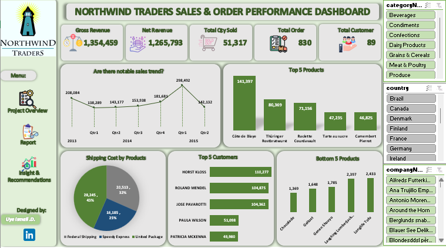

#  Northwind-Trader-Report

## 📘 Project Overview  
**Northwind Traders** is a fictional gourmet food supplier that specializes in **premium specialty food products** 🍴 and serves a diverse range of customers across multiple global regions 🌍.  

This project features an **interactive Excel dashboard** 📊 built from transactional data extracted from a CSV file. The dashboard provides a comprehensive summary of:  
- 🔹 **Sales performance** and revenue trends  
- 🔹 **Customer engagement** and key account contributions  
- 🔹 **Product performance**, highlighting best and worst sellers  
- 🔹 **Shipping cost distribution** across different service providers 🚚  

The goal is to transform raw data into **actionable insights** that support informed business and strategic decision-making ✅.  

---

## 🎯 Objectives  
- Deliver a high-level yet actionable summary of sales trends 📈  
- Highlight key customers driving overall business performance 👥  
- Identify both top- and bottom-performing products 🏆📉  
- Analyze shipping cost distribution across providers 🚚  
- Support smarter, data-driven business decisions 💡

---

## 🛠️ Tools & Technologies  
- **Microsoft Excel** - Dashboard design, data visualization & analysis  
- **Northwind Traders Dataset** - Provided by *Maven Analytics* for realistic business insights  

---

## 🌐 Live Dashboard  
Experience the interactive dashboard live here:
[Click to view the live dashboard](https://1drv.ms/x/c/a145471cdb65b729/ETEpmJ-aCApLnQc4Clr0tQYBHPCqWYKrMmRjWo8F04lDBw?e=qhycpg)

---

## 🎯 Purpose  
- Deliver a **clear, interactive snapshot** of sales operations  
- Focus on the time period **2013–2015**  
- Enable stakeholders to make **informed strategic decisions**  
- Support **operational decision-making** with data insights

---

## 🔑 Key Insights from Dashboard  
- **Gross Revenue:** 💰 1,354,459  
- **Net Revenue:** 💵 1,265,793  
- **Total Quantity Sold:** 📦 51,317  
- **Total Orders:** 🛒 830  
- **Total Customers:** 👥 89 
 
---

## 🖼️ Dashboard Preview 

---

## ❓ Key Business Questions Answered  
- 📈 Are there noticeable **sales trends over time**?  
- 🏆 Which are the **best and worst-selling products**?  
- 👤 Can you identify any **key customers**?  
- 🚚 Are **shipping costs consistent** across providers? 

## 📌 Key Insights 
- **Sales Trends:** Clear seasonal pattern, with **Q4 2014** showing a remarkable spike.  
- **Sales Volatility:** Q4 2014 surge highlights potential for seasonal promotions.  
- **Product Performance:** *Côte de Blaye* is the **best-seller**, while *Alice Mutton* and *Longlife Tofu* underperform.  
- **Customer Segmentation:** A few key clients drive a **large share of sales**, showing dependency risk.  
- **Shipping Cost Disparity:** Federal Shipping dominates but shows **higher cost concentration**.  

---

## 🧭 Recommendations  
- 🔎 **Investigate Sales Dip in 2015** → Explore monthly/region-level details for root causes.  
- 🎉 **Replicate Q4 2014 Strategy** → Analyze promotions/events and apply yearly.  
- 📉 **Phase Out or Rebrand Underperformers** → Optimize product portfolio.  
- 🤝 **Strengthen Relationships with Key Clients** → Loyalty programs, volume discounts.  
- 🌍 **Expand Customer Base** → Reduce dependency on few accounts via digital outreach.  
- 🚚 **Optimize Shipping Strategy** → Negotiate rates, balance load across providers.  
- 📑 **Audit Shipping Contracts** → Improve terms with Federal Shipping.  
- 🏷️ **Improve Data Labeling** → Maintain consistency for long-term analytics.  

---

## 🚀 How to Use This Project  
- 📂 **Download/Clone the Repository** – Get a copy of the project files onto your local machine.  
- 📊 **Open the Excel File** – Launch the dashboard file in **Microsoft Excel (2016 or later)** for best compatibility.  
- 🔍 **Explore Dashboard** - Interact with slicers, filters, and pivot visuals.  
- 📈 **Analyze Trends & Patterns** – Gain insights on revenue, customers, and shipping efficiency.   
- 📝 **Apply Findings** - Translate insights into actionable business strategies.  

---

## 🏁 Conclusion  
This project provides a **comprehensive snapshot of Northwind Traders’ sales performance** between 2013 and 2015.  
Through interactive Excel dashboards, it highlights:  
- ✅ Clear sales trends and anomalies (e.g., the Q4 2014 spike)  
- ✅ Top-performing vs underperforming products  
- ✅ Heavy dependence on a few key customers  
- ✅ Disparities in shipping costs among providers  

By leveraging these insights, businesses can **replicate success, address weaknesses, and optimize operations** for better profitability.  

🔗 I encourage you to explore the dashboard, test different filters, and discover how data-driven decision-making can transform business strategies.  

---

## 👨‍💻 Author  
**Ismail** – *Data Analyst | Data Enthusiast*  

I’m passionate about turning raw datasets into meaningful insights 📊. With hands-on experience in **Excel**, **SQL**, and **Power BI**, I enjoy analyzing, visualizing, and storytelling with data to support smarter business decisions 🚀.  

---

🔗 **Let’s Connect**  
- 🌐 [LinkedIn](https://www.linkedin.com/in/uye-ismail-d)  
- 📧 uyedanzismuye@gmail.com  
- 📧 uyeismaildanzismuye@gmail.com  

💡 *“Without data, you’re just another person with an opinion.”* – W. Edwards Deming  

---

## 🙏 Closing Note  
Thank you for taking the time to explore this project 💡.  
I hope the insights and recommendations spark new ideas and inspire smarter decisions.  

Feel free to ⭐ this repo if you found it useful, and don’t hesitate to explore my other projects for more data stories 📊✨.  

I’m always open to collaboration, feedback, and knowledge-sharing; let’s connect and build something impactful together! 🤝  
